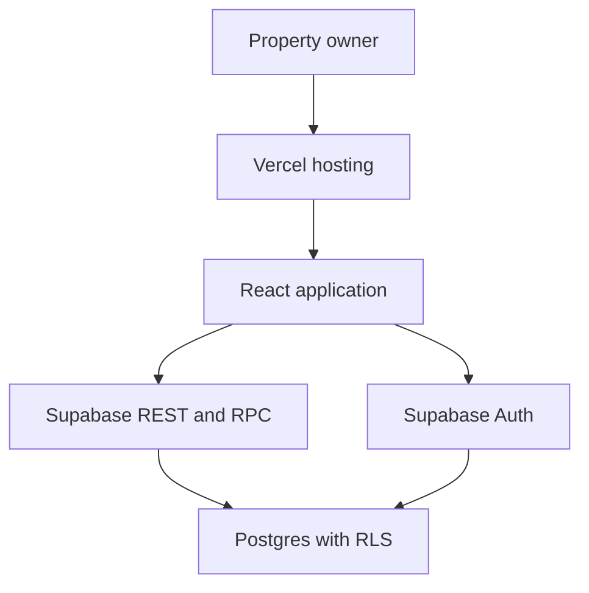
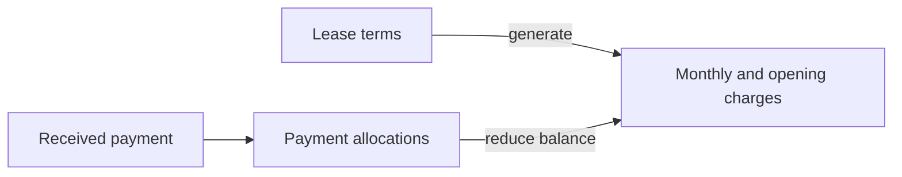

<div align="center">
  

  <h1>BahayRentahan</h1>

  <p><strong>Boarding-house operations, organized down to every bedspace.</strong></p>

  <p>
    A responsive property-management application that helps boarding-house owners manage rooms, occupants, rent records, and maintenance work from one calm, dependable workspace.
  </p>

  <p>
    
    
    
    
    
  </p>
</div>

---

## The product

Small boarding-house operations are often managed through notebooks, spreadsheets, chat messages, and disconnected payment screenshots. That makes simple questions unnecessarily difficult:

- Which beds are still available?
- Who currently occupies each bedspace?
- Who has paid for the current rent period?
- Where is the receipt for a specific payment?
- Which maintenance concerns still need attention?

BahayRentahan brings those workflows together in one focused application. It models occupancy at the **bedspace level**, keeps agreed lease terms separate from monthly obligations and received money, preserves the history behind assignments and payments, and gives owners an interface that remains practical on both a laptop and a phone.

This is more than a visual dashboard. It is a full-stack portfolio project with authentication, database security, relational data, domain-specific workflows, responsive interaction design, and deployable infrastructure.

> **Payment scope:** BahayRentahan records rent received through cash, GCash, or bank transfer. It does not collect money or act as a payment gateway.

## Product highlights

### See the entire property at a glance

The overview turns operational data into useful answers: current occupancy, vacant beds, rent collection, active boarders, and outstanding maintenance needs. Revenue summaries follow the property's configured timezone so the displayed period matches the owner's local calendar.

### Manage rooms down to each bedspace

Owners can create complete rooms or add a single bedspace to an existing room. Every bed shows its label, monthly rent, availability, and current occupant. Records with history are archived safely instead of being removed blindly.

### Follow the complete boarder lifecycle

BahayRentahan supports the real sequence of boarding-house work:

1. Create the boarder's profile.
2. Assign the boarder to a vacant bedspace.
3. Review their contact, occupancy, and payment details.
4. Transfer them to another available bed when necessary.
5. Move them out without losing historical records.

Search, status filters, pagination, and mobile-friendly details keep the directory manageable as the property grows.

### Keep payment records trustworthy

Owners can record full or partial payments, divide one receipt across rent, advance rent, and security-deposit charges, mark entries for confirmation, void incorrect records, generate receipt numbers, view payment history, print or save receipts, and export records to CSV. Deposits remain visible as funds held instead of being reported as monthly rent revenue.

Payment creation is handled through database functions so validation and record integrity do not depend only on the browser interface.

### Turn agreements into an auditable billing ledger

Each assignment creates a versioned lease term with the agreed rent, per-boarder due day, grace period, deposit, advance rent, and effective date. BahayRentahan generates the expected monthly charge separately, then connects received money through payment allocations. This keeps three different questions from being mixed together: what was agreed, what became due, and what was actually paid.

### Track maintenance without another tool

Maintenance needs live beside the property and occupancy data. Owners can capture the concern, identify its location, assign a priority, and follow its status from open to completed.

### Run access manually without a payment gateway

New owners begin in a pending state. A protected administrator workspace can activate, renew, expire, or suspend an account after receiving payment through cash, GCash, bank transfer, or a complimentary arrangement. Each change records the amount, payment reference, expiration date, notes, and administrator action in an audit history. Application screens and database policies both enforce the resulting access state.

### Close every month with a dependable report

The Reports workspace separates rent billed for a period from cash actually received during that month. Owners can review balances per boarder, identify late or partial accounts, track security deposits separately from rent revenue, export the monthly ledger to CSV, print a clean report, and download a complete JSON backup of their property records.

### Work comfortably from a phone

BahayRentahan does not shrink the desktop interface and call it mobile. Small screens receive a dedicated bottom navigation pattern, touch-friendly controls, stacked information, scrollable sheets, compact action groups, and safe spacing around fixed controls.

## Why this project stands out

- **Domain-aware design:** Rooms, individual beds, occupants, assignments, rent periods, and maintenance records have distinct responsibilities.
- **History-preserving workflows:** Transfers, move-outs, archives, confirmations, and voids protect the story behind the data.
- **Secure by default:** Supabase Row Level Security limits access to properties owned by the authenticated user.
- **Responsive beyond breakpoints:** Navigation, cards, dialogs, forms, tables, and action hierarchies adapt to the task and available space.
- **Free-tier conscious:** The application uses a static Vite front end and Supabase services without requiring a continuously running custom server.
- **Maintainable front end:** Feature-based modules, repository abstractions, shared UI primitives, and typed domain models keep concerns separated.
- **Operational feedback:** Loading, empty, success, failure, unsaved-change, and offline states help users understand what is happening.

## UX principles behind BahayRentahan

The interface is intentionally calm because the information itself is operationally important.

- **Clarity before decoration:** Occupancy, balances, and statuses are readable before secondary actions compete for attention.
- **Progressive disclosure:** Lists stay scannable while drawers and dialogs reveal deeper information only when requested.
- **Visible system status:** Users receive immediate feedback for network state, loading, saving, confirmation, and errors.
- **Safe destructive actions:** Move-out, archive, delete, and void operations require clear confirmation and preserve related history where needed.
- **Mobile reachability:** Frequent destinations and primary actions remain accessible without forcing desktop interaction patterns onto a phone.
- **Accessible interaction:** Semantic controls, visible focus states, readable contrast, useful labels, and practical touch targets support more users and input methods.

## Core capabilities

### Property and occupancy

- Automatic owner profile and first-property setup
- Multiple property workspaces
- Room and individual-bedspace creation
- Occupied, vacant, and rent-due summaries
- Safe room and bedspace editing or archival
- Occupancy history preservation

### Boarders

- Boarder profile creation and editing
- Vacant-bed assignment
- Per-boarder monthly due day and grace period
- Lease effective dates, advance rent, and security-deposit terms
- Bedspace transfer
- Move-out and archival workflows
- Search, status filtering, and pagination
- Detailed occupancy, contact, and payment views

### Payments

- Cash, GCash, and bank-transfer records
- Full and partial payment support
- Monthly charge generation from active lease terms
- Multi-charge payment allocation
- Owner-created utility, damage, or other documented charges
- Separate rent revenue and deposits-held reporting
- Pending, confirmed, and voided statuses
- Property-specific receipt numbering
- Rent-period tracking
- Printable receipts and CSV export

### Operations

- Maintenance-need tracking
- Global workspace search
- In-app notification center
- Property timezone configuration
- Profile, settings, and help-center views
- Responsive desktop and mobile navigation

### Administration and continuity

- Pending, active, expired, and suspended account states
- Manual Cash, GCash, bank-transfer, or complimentary activation
- Optional expiration dates or explicitly unlimited access
- Activation payment and administrator audit history
- Server-authorized account management
- Monthly rent, collection, deposit, and balance reports
- Printable reports and CSV export
- Complete property JSON backups, including archived and historical records

## Technology

- **React 18** for the component-based application interface
- **TypeScript** for safer domain models and repository contracts
- **Vite 5** for a fast development and production build pipeline
- **Supabase Auth** for email and password authentication
- **Supabase Postgres** for relational property and payment data
- **Supabase REST and RPC** for browser-to-database operations
- **Row Level Security** for property-level authorization
- **Lucide React** for a consistent icon system
- **Vercel** for static front-end hosting and SPA routing

## Architecture



Vercel delivers the compiled application. After it loads, the browser communicates directly with Supabase using the public publishable key and the signed-in user's access token. Row Level Security remains the final authorization boundary for application data.

The Supabase `service_role` key is never used in the front end.

### Billing data model



The separation is deliberate: changing a bedspace label does not rewrite an agreement, generating a charge does not pretend money was received, and receiving a deposit does not inflate rent revenue.

## Data integrity and security

BahayRentahan places important business rules close to the data:

- Users can access only properties they own.
- Related rooms, bedspaces, boarders, assignments, payments, and needs follow property ownership policies.
- Assignment functions prevent invalid occupancy changes.
- Transfer and move-out workflows close existing assignments correctly.
- Payment functions validate ownership and create consistent receipt records.
- Lease terms are versioned by occupancy, while monthly charges preserve the amount and due date expected for each period.
- Payment allocations prevent a receipt from exceeding a charge's remaining balance and reserve balances for pending payments.
- Pending, expired, and suspended owners are blocked by Row Level Security, not only by interface routing.
- Only accounts explicitly listed in `app_admins` can run access-management functions.
- Activation and renewal changes are retained in a separate audit log.
- Records with operational history can be archived rather than silently destroyed.

This design reduces the risk of relying on hidden buttons or client-side checks as security controls.

## Application areas

- `/` — product landing page
- `/login` — sign in, account creation, and password recovery
- `/app#/dashboard` — property overview and financial snapshot
- `/app#/spaces` — rooms and bedspaces
- `/app#/tenants` — boarder directory and details
- `/app#/payments` — payment records and receipts
- `/app#/reports` — monthly reports, CSV export, printing, and property backup
- `/app#/needs` — maintenance tracking
- `/app#/admin` — administrator-only customer activation and renewal controls
- `/app#/settings` — property and application preferences
- `/app#/help` — help center
- `/app#/profile` — owner profile

Authenticated sections use hash-based navigation so the application works reliably on static hosting without requiring a custom routing server.

## Run BahayRentahan locally

### Requirements

- Node.js 18 or newer
- npm
- A Supabase project

After cloning or extracting the project, open its folder and install the locked dependency versions:

```bash
cd BahayRentahan-React-Vite-Supabase
npm ci
```

Create your local environment file:

```bash
cp .env.example .env.local
```

Add your Supabase project credentials:

```env
VITE_SUPABASE_URL=https://your-project-ref.supabase.co
VITE_SUPABASE_PUBLISHABLE_KEY=your-publishable-key
```

Start the application:

```bash
npm run dev
```

Open [http://127.0.0.1:5173](http://127.0.0.1:5173).

### When should you run `npm ci`?

Run `npm ci` after a fresh clone or ZIP extraction, when `package-lock.json` changes, or when the local dependency installation becomes unreliable. You do not need it after normal React, CSS, or documentation updates.

Use `npm install <package>` when intentionally adding or updating a dependency, then commit both `package.json` and `package-lock.json`.

## Configure Supabase

Create a Supabase project, open its **SQL Editor**, and run the migrations in this exact order:

```text
supabase/migrations/001_bedkeep_initial_schema.sql
supabase/migrations/002_complete_ux_workflows.sql
supabase/migrations/003_payment_integrity.sql
supabase/migrations/004_property_timezone.sql
supabase/migrations/005_lease_billing_ledger.sql
supabase/migrations/006_access_reports_and_performance.sql
```

The migrations establish the schema, Row Level Security policies, owner onboarding, occupancy workflows, safe archival behavior, payment functions, receipt numbering, property timezone support, the lease-aware billing ledger, administrator activation, reporting indexes, and account-access enforcement. Migration `005` safely backfills existing occupancies, payment periods, and payment allocations before generating the current month's expected charges. Migration `006` keeps existing owners active, while new signups begin as pending.

### Create the first administrator

After running migration `006`, create your own account through the application. Then run this once in the Supabase SQL Editor, replacing the email address with your administrator email:

```sql
insert into public.app_admins(user_id)
select id from auth.users where email = 'your-admin@email.com'
on conflict (user_id) do nothing;

update public.account_access
set status = 'active', activated_at = now(), expires_at = null, updated_at = now()
where user_id = (select id from auth.users where email = 'your-admin@email.com');
```

Sign out and sign in again. **Administration** will appear in the desktop sidebar and the mobile More menu. New customer accounts can then be activated after you verify their Cash or GCash payment. For a ₱250 monthly plan, enter `250` as the amount and choose a paid-through date one month ahead. Use **No expiration** only when you deliberately want unlimited access.

> Never place the Supabase `service_role` key in `.env.local`, Vercel, browser code, or the administrator screen. The activation functions use the signed-in administrator identity and server-side database authorization.

In **Authentication → URL Configuration**, use these values for local development:

```text
Site URL: http://127.0.0.1:5173
Redirect URL: http://127.0.0.1:5173/**
```

Add the production domain and its wildcard redirect after deployment. Keep the local redirect if local development will continue.

## Deploy to Vercel

1. Push the project to a GitHub repository.
2. Import that repository into Vercel.
3. Add `VITE_SUPABASE_URL` and `VITE_SUPABASE_PUBLISHABLE_KEY` to the Vercel project environment variables.
4. Deploy the application.
5. Add the deployed domain to the Supabase authentication URL configuration.

The included `vercel.json` configures the Vite build output and SPA fallback behavior.

## Repository structure

```text
bahayrentahan-vercel-supabase/
├── public/                 Brand and browser assets
├── src/
│   ├── components/         Shared interface and BahayRentahan components
│   ├── features/           Feature-specific views, state, and repositories
│   ├── lib/                Domain types, validation, dates, and Supabase setup
│   ├── index.css           Responsive design system
│   └── main.tsx            Application entry point
├── supabase/
│   └── migrations/         Ordered schema and workflow migrations
├── .env.example            Safe environment-variable template
├── package.json            Scripts and dependency declarations
├── package-lock.json       Reproducible dependency versions
├── vercel.json             Hosting and route configuration
└── vite.config.ts          Development and build configuration
```

## Build verification

Create a production build before deployment:

```bash
npm run build
```

This command runs the TypeScript checks and creates the optimized Vite output in `dist/`.

Preview that production build locally with:

```bash
npm run preview
```

<details>
<summary><strong>Compatibility and troubleshooting</strong></summary>

### `getaddrinfo ENOTFOUND localhost`

BahayRentahan binds the local server to `127.0.0.1` for broader compatibility. Start it with `npm run dev` and open `http://127.0.0.1:5173`.

### macOS reports `_SecTrustCopyCertificateChain` while installing esbuild

The project pins Vite and esbuild versions compatible with older macOS releases. Use the included lockfile and run `npm ci`.

### `record_billing_payment` or `generate_monthly_charges` returns 404

Run `supabase/migrations/005_lease_billing_ledger.sql`, allow Supabase to refresh its schema cache, and reload the application. Run migrations `001` through `004` first on a new project.

### The activation or administrator screen says migration `006` is missing

Run `supabase/migrations/006_access_reports_and_performance.sql` after migrations `001` through `005`. Then sign out and back in so the application requests the new access state.

### A payment says the remaining balance is `0.00`

Migration `005` repairs legacy zero-rent occupancies and replaces period-only payment validation with explicit charge allocations. After applying it, reload BahayRentahan and choose an open charge in the payment dialog.

### A new boarder is missing from the payment form

Payments belong to an active bedspace assignment. Assign the boarder to a vacant bedspace first, then return to Payments.

### The application shows a configuration screen

Confirm that `.env.local` contains both required `VITE_` variables, then restart the development server so Vite can load them.

### Device emulation appears offline

Open the browser developer tools **Network** panel and change throttling to **No throttling**. Device dimensions and network simulation are separate settings.

</details>

## Free-tier considerations

The architecture is intentionally lightweight and suitable for evaluating or operating a small project within available free allowances. Provider plans and limits can change, so they should still be reviewed before deployment.

- Check the current [Supabase plan limits](https://supabase.com/pricing) and monitor database, storage, and egress usage.
- Review the current [Vercel Hobby plan terms](https://vercel.com/docs/plans/hobby), particularly before commercial use.
- Keep stored files modest and maintain independent data exports or backups.
- Download a complete JSON backup from **Reports & backup** after each monthly close and store it somewhere private outside Supabase.
- Treat Supabase as the source of truth rather than relying on browser storage.

## Current product scope

BahayRentahan focuses on the property-owner experience plus a separate platform-administrator control surface. It includes secure property setup, bed-level occupancy management, boarder lifecycle handling, lease-aware rent accounting, receipts, maintenance tracking, manual customer activation, monthly reporting, and owner-controlled data export.

Staff accounts, boarder-facing accounts, automated payment collection, automatic restore from backup, SMS delivery, and accounting integrations are intentionally outside the current scope.

---

<div align="center">
  <strong>BahayRentahan</strong><br />
  Built to make every room, bedspace, boarder, and payment easier to account for.
</div>
